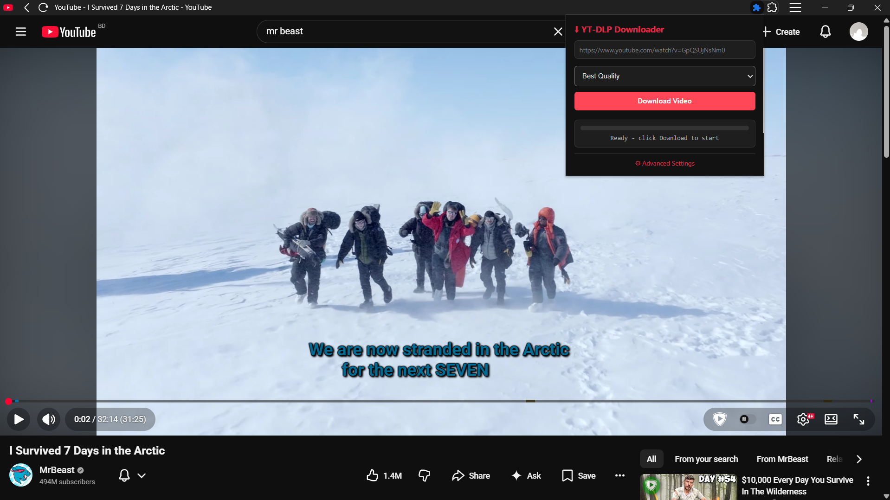

# YT-DLP Video Downloader

> **One-click video / audio downloader for 1000+ websites** — YouTube, Twitter/X, TikTok, Instagram, Facebook, Reddit, Twitch, Vimeo, and more.

[](https://opensource.org/licenses/MIT)
[](https://www.python.org/downloads/)
[](https://github.com/yt-dlp/yt-dlp)

A browser extension + Python backend that brings the power of [yt-dlp](https://github.com/yt-dlp/yt-dlp) to your browser toolbar. No command line needed. Just click, choose quality, and download.



## Features

- **One-click downloads** from any website while you browse
- **1000+ supported sites** — anything yt-dlp supports (YouTube, TikTok, Twitter, Instagram, Facebook, Reddit, Twitch, Vimeo, Bilibili, SoundCloud, etc.)
- **Multiple formats** — Best Quality, 1080p, 720p, or Audio-only MP3
- **Live progress bar** — See download %, speed, and ETA in real-time
- **Background downloads** — Close the popup, download keeps running
- **Custom save location** — Choose any folder via Advanced Settings
- **Auto-start option** — Server starts automatically with Windows
- **Dark theme UI** — Clean, modern interface

## Screenshots

| Extension Popup | Download Progress | Advanced Settings |
|:---:|:---:|:---:|
|  |  |  |

## Prerequisites Setup (Do This First)

Before using the extension, you need **Python** and **yt-dlp** installed on your PC.

### 1. Install Python

1. Go to [python.org/downloads](https://www.python.org/downloads/)
2. Download **Python 3.11+** (or the latest version)
3. Run the installer
4. **CHECK "Add Python to PATH"** at the bottom of the installer (this is critical!)
5. Click **Install Now**
6. Verify: Open CMD and type:
   ```bash
   python --version
   ```
   It should show something like `Python 3.11.x`

> **If you already have Python installed but it's not in PATH**, you can either:
> - Reinstall Python and check "Add to PATH", OR
> - Place `yt-dlp.exe` in your Downloads folder (see Option A below)

### 2. Install yt-dlp

**Option A — Download EXE (Easiest for beginners):**
1. Go to [yt-dlp releases](https://github.com/yt-dlp/yt-dlp/releases/latest)
2. Download `yt-dlp.exe` from the Assets section
3. Place `yt-dlp.exe` in your **Downloads** folder (`C:\\Users\\YourName\\Downloads`)
4. Done! The server will find it automatically

**Option B — Install via pip (if Python is in PATH):**
```bash
python -m pip install yt-dlp
```

### 3. Verify Everything Works

Open CMD and run:
```bash
python --version
yt-dlp --version
```

Both should show version numbers. If yes, you are ready to use the extension!

## Quick Start (3 Steps)

### 1. Start the Backend Server

**Option A — Auto-start forever (Recommended):**
```bash
Double-click: Add_to_Startup.bat
```
- Server runs silently in background on every Windows boot
- No black CMD window ever appears
- You never have to think about it again

**Option B — Manual start each time:**
```bash
Double-click: Start_Server.bat
```
- A black CMD window stays open — keep it open while browsing
- Close it when you are done downloading

**Option C — Silent manual start:**
```bash
Double-click: Start_Background.bat
```
- Starts the server with NO visible window
- Uses `pythonw.exe` if available

### 2. Install the Browser Extension

1. Open Chrome/Edge/Brave and go to `chrome://extensions/`
2. Turn ON **"Developer mode"** (toggle at top-right)
3. Click **"Load unpacked"**
4. Select the `extension/` folder from this repo
5. Pin the extension to your toolbar: click the puzzle icon (&#129513;) → **Pin** YT-DLP Downloader

### 3. Download Any Video

1. Go to any website with a video
2. Click the **YT-DLP** icon (&#11015;) in your toolbar
3. Select format: **Best / 1080p / 720p / MP3**
4. Click **Download Video**
5. Watch the live progress bar in the popup
6. File saves automatically to your chosen folder

> **Tip:** You can close the popup while downloading. The server runs in the background. Re-open the popup anytime to check progress.

## System Requirements

| Requirement | How to check / install |
|---|---|
| **Windows 10/11** | Required for batch scripts |
| **Python 3.8+** | See [Prerequisites Setup](#prerequisites-setup-do-this-first) above |
| **yt-dlp** | See [Prerequisites Setup](#prerequisites-setup-do-this-first) above |
| **Flask** | Auto-installed by `Start_Server.bat` on first run |
| **Chrome / Edge / Brave** | Any modern Chromium-based browser |

## File Structure

```
YT-DLP-Video-Downloader/
├── extension/              # Browser extension (Chrome/Edge/Brave)
│   ├── manifest.json       # Extension manifest (Manifest V3)
│   ├── popup.html            # Download UI with progress bar
│   ├── popup.js              # URL detection + server communication
│   ├── options.html          # Advanced Settings page
│   ├── options.js            # Settings save/load logic
│   ├── background.js         # Service worker
│   └── icon48.png            # Extension icon
├── backend/                # Python server
│   ├── yt-dlp-bridge.py      # Flask server, runs yt-dlp in background
│   └── requirements.txt      # Flask dependencies
├── screenshots/            # Screenshots for README
├── Start_Server.bat            # Manual start (visible window, most reliable)
├── Start_Background.bat        # Silent background start
├── Add_to_Startup.bat          # Auto-start on Windows login (RECOMMENDED)
├── Remove_from_Startup.bat     # Remove auto-start
├── Stop_Server.bat             # Stop running server
├── Check_Server.bat            # Diagnose connection issues
├── Test_Server.html            # Browser connectivity test
├── README.md                   # This file
└── LICENSE                     # MIT License
```

## Supported Websites

Any site supported by [yt-dlp](https://github.com/yt-dlp/yt-dlp/blob/master/supportedsites.md), including:

- **YouTube** — videos, Shorts, playlists, livestreams
- **Twitter / X** — tweets with video
- **TikTok** — videos, profiles, slideshows
- **Instagram** — posts, Reels, stories, IGTV
- **Facebook** — videos, reels, watch
- **Reddit** — videos, GIFs
- **Twitch** — clips, VODs, livestreams
- **Vimeo**, **Dailymotion**, **Bilibili**, **SoundCloud**
- **1000+ more sites**

## Troubleshooting

| Problem | Solution |
|---|---|
| Extension says **"Server offline"** | Run `Start_Server.bat` or `Add_to_Startup.bat`. Keep the window open. |
| **"yt-dlp not found"** error | Download [yt-dlp.exe](https://github.com/yt-dlp/yt-dlp/releases/latest) and place it in your Downloads folder. Or install via `python -m pip install yt-dlp`. |
| **"Python not found"** error | Reinstall Python and **check "Add to PATH"**. See [Prerequisites Setup](#1-install-python). |
| **"Flask not found"** error | The batch file auto-installs it. If it fails, run `python -m pip install flask flask-cors` manually. |
| Download fails on a specific site | Some sites require cookies or have DRM protection. Check [yt-dlp docs](https://github.com/yt-dlp/yt-dlp/wiki) for that site. |
| Extension won't install | Make sure you selected the `extension/` **folder**, not individual files. |
| Server crashes on startup | Run `Check_Server.bat` to diagnose. It checks Python, Flask, yt-dlp, and server status. |
| Check_Server.bat closes instantly | This means Python is not in PATH. Follow [Prerequisites Setup](#1-install-python). |

## How to Stop / Remove

| Action | How |
|---|---|
| Stop server temporarily | Open Task Manager → Details → find `python.exe` or `pythonw.exe` → End Task |
| Stop via batch | Double-click `Stop_Server.bat` |
| Remove auto-start | Double-click `Remove_from_Startup.bat` |
| Uninstall extension | Go to `chrome://extensions/` → find YT-DLP → click **Remove** |

## Advanced Settings

Click **&#9881; Advanced Settings** in the extension popup to configure:

- **Download directory** — Default is your Windows `Downloads` folder. Change to any folder (e.g., `D:\\Videos\\YT-DLP`).
- **Default format** — Pre-select your preferred quality so you don't have to change it every time.

Settings are saved to `backend/settings.json`.

## How It Works

```
Browser Extension  --detects current URL-->  Python Server (Flask) on localhost:8765
                                                    |
                                                    v
                                        Spawns yt-dlp process in background
                                                    |
                                                    v
                                        Parses real-time console output
                                                    |
                                                    v
                                        Extension polls every 500ms
                                                    |
                                                    v
                                        Updates progress bar in popup
                                                    |
                                                    v
                                        Video file saved to chosen directory
```

Everything stays **local** — no data leaves your computer. The server only communicates with your own browser on `127.0.0.1`.

## FAQ

**Q: Do I have to start the server every time I want to download?**
A: No! Run `Add_to_Startup.bat` once. The server auto-starts silently every time Windows boots.

**Q: Can I close the browser popup while downloading?**
A: Yes! The download runs in the Python server background. Re-open the popup anytime to check progress.

**Q: Is this safe? I see python.exe running in Task Manager.**
A: Yes, that's your local server. It only runs when you started it and only talks to your own browser.

**Q: Does it work on Mac or Linux?**
A: Currently Windows only (batch scripts). Mac/Linux support is on the roadmap — contributions welcome!

**Q: Can I download playlists?**
A: Currently single videos only. Playlist support is planned for a future update.

## Contributing

Pull requests welcome! Areas to improve:

- **Firefox support** — adapt manifest and popup for Firefox
- **macOS / Linux compatibility** — shell scripts instead of batch files
- **Playlist auto-detection** — detect playlists and list all videos
- **Thumbnail previews** — show video thumbnail before downloading
- **Download history** — keep a log of downloaded videos
- **Single EXE version** — package everything with PyInstaller

## License

[MIT](LICENSE) — free for personal and commercial use.

## Credits

- Built on [yt-dlp](https://github.com/yt-dlp/yt-dlp) — the most powerful video downloader
- Browser extension uses [Flask](https://flask.palletsprojects.com/) + [Flask-CORS](https://flask-cors.readthedocs.io/)

---

**Star &#11088; this repo if it helped you!**
